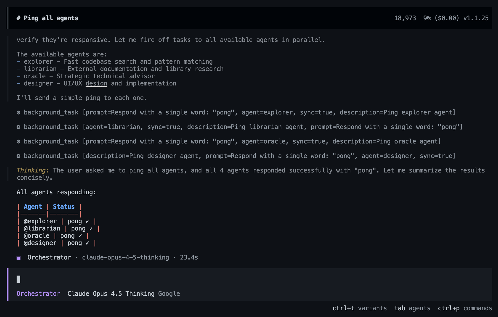

<div align="center">

# oh-my-opencode-slim

**适用于 OpenCode 的轻量级强大代理编排插件**


*将你的 AI 助手转变为能够将复杂任务委派给专门子代理、在后台运行搜索并轻松管理多步工作流的管理者。*

</div>

> 这是[oh-my-opencode](https://github.com/code-yeongyu/oh-my-opencode)的精简分支 -  - 专注于低令牌消耗的核心代理编排。  
> **推荐订阅 [Antigravity](https://antigravity.google)。** 万神殿经过 Antigravity 模型路由的调优。其他提供商也可用，但使用 Antigravity 能获得最佳体验。

---

## ⚡ 快速导航

- [🚀 **安装**](#安装)
  - [给人类的指南](#给人类的指南)
  - [给 LLM 代理的指南](#给-llm-代理的指南)
- [🏗️ **架构与流程**](#-架构与流程)
- [🏛️ **认识万神殿**](#认识万神殿)
  - [编排者 (Orchestrator)](#编排者-orchestrator)
  - [探索者 (Explorer)](#探索者-explorer)
  - [神谕者 (Oracle)](#神谕者-oracle)
  - [图书管理员 (Librarian)](#图书管理员-librarian)
  - [设计师 (Designer)](#设计师-designer)
  - [修复者 (Fixer)](#修复者-fixer)
- [🧩 **技能**](#-技能)
  - [可用技能](#可用技能)
  - [默认技能分配](#默认技能分配)
  - [YAGNI 约束](#yagni-约束)
  - [Playwright 集成](#playwright-集成)
  - [自定义代理技能](#自定义代理技能)
- [🛠️ **工具与能力**](#工具与能力)
  - [Tmux 集成](#tmux-集成)
  - [配额工具](#配额工具)
  - [后台任务](#后台任务)
  - [LSP 工具](#lsp-工具)
  - [代码搜索工具](#代码搜索工具)
- [🔌 **MCP 服务器**](#mcp-服务器)
- [⚙️ **配置**](#配置)
  - [需要编辑的文件](#需要编辑的文件)
  - [插件配置](#插件配置-oh-my-opencode-slimjson)
- [🗑️ **卸载**](#卸载)

---

## 安装

### 给人类的指南

运行交互式安装器：

```bash
bunx oh-my-opencode-slim install
```

或使用非交互模式：

```bash
bunx oh-my-opencode-slim install --no-tui --antigravity=yes --openai=yes --tmux=no
```

安装完成后，使用提供商进行身份验证：

```bash
opencode auth login
# 选择你的提供商 → 完成 OAuth 流程
# 对所有启用的提供商重复此步骤
```

身份验证完成后，运行 opencode 并执行 `ping all agents` 以验证所有代理是否响应。



> **💡 小贴士：模型完全可自定义。** 安装器会设定合理的默认值，但你可以将 *任何* 模型分配给 *任何* 代理。编辑 `~/.config/opencode/oh-my-opencode-slim.json` 来覆盖模型、调整推理强度或完全禁用代理。详见[配置](#配置)。

**备用方式：询问任意编码代理**

将以下内容粘贴到 Claude Code、AmpCode、Cursor 或任何编码代理：

```
Install and configure by following the instructions here:
https://raw.githubusercontent.com/alvinunreal/oh-my-opencode-slim/refs/heads/master/README.md
```

### 给 LLM 代理的指南

<details>
<summary>LLM 代理的操作说明（点击展开）</summary>

如果你是正在帮助设置 oh-my-opencode-slim 的 LLM 代理，请按以下步骤执行。

---

#### 步骤 1：确认 OpenCode 安装状态

```bash
opencode --version
```

如果未安装，请先引导用户访问 https://opencode.ai/docs 。

---

#### 步骤 2：询问提供商访问情况

逐条询问以下问题，等待用户回应后再继续：

1. “你是否订阅了 **Antigravity**？”（可使用 `google/` 前缀访问 Claude + Gemini）
2. “你是否有 **OpenAI** API 的访问权限？”

---

#### 步骤 3：运行安装器

根据回答运行：

```bash
bunx oh-my-opencode-slim install --no-tui --antigravity=<yes|no> --openai=<yes|no>
```

**示例：**
```bash
# Antigravity + OpenAI
bunx oh-my-opencode-slim install --no-tui --antigravity=yes --openai=yes --tmux=no

# 仅 OpenAI
bunx oh-my-opencode-slim install --no-tui --antigravity=no --openai=yes --tmux=no

# 无提供商（仅使用 Zen 免费模型）
bunx oh-my-opencode-slim install --no-tui --antigravity=no --openai=no --tmux=no
```

安装器会自动完成：
- 将插件添加到 `~/.config/opencode/opencode.json`
- (如启用 Antigravity) 添加 `opencode-antigravity-auth` 插件
- 配置 Google 提供商的模型定义
- 在 `~/.config/opencode/oh-my-opencode-slim.json` 中生成代理模型映射

---

#### 步骤 4：身份验证

安装完成后，引导用户：

**Antigravity：**
```bash
opencode auth login
# 选择：Google → 通过 Google (Antigravity) 的 OAuth
# 对所有其他提供商重复
```

---

#### 故障排查

如果安装失败，确认配置格式：

```bash
bunx oh-my-opencode-slim install --help
```

然后手动创建配置文件：
- `~/.config/opencode/opencode.json`
- `~/.config/opencode/oh-my-opencode-slim.json`

</details>

---

## 🏗️ 架构与流程

该插件采用“中心辐射”模型：

1. **编排者 (Orchestrator，中心)：** 处理用户请求的主入口。分析任务并决定调用哪些专门代理。
2. **专门代理 (Spokes)：** 领域专家（如 UI/UX、文档、架构）只处理狭窄任务，确保高精度。
3. **后台管理器：** 强大的引擎允许编排者“放任”任务（例如深入代码搜索或文档研究），同时继续处理其他部分。

### 🏛️ 请求流程


1. **用户提示：** “重构认证逻辑并更新文档。”
2. **编排者：** 创建 TODO 列表。
3. **任务分配：**
   - 启动 `@explorer` 后台任务查找所有与认证相关的文件。
   - 启动 `@librarian` 查询认证库的最新文档。
4. **集成：** 等待后台结果就绪后，编排者将任务交给 `@fixer` 高效实施重构。

---

## 认识万神殿

<br clear="both">

### 编排者 (Orchestrator)

<a href="src/agents/orchestrator.ts"></a>

> **编排者**诞生于第一个代码库崩溃于自身复杂性之时。既非神亦非凡人，凭借虚无中诞生的秩序，他们统领混沌。他们不只是指挥军队，而是与之并肩作战。每行代码都要经过他们之手，然后再决定将哪块谜题交给其他较低等的神明。

**角色：** `至高执行者、指挥者、监督者`  
**模型：** `google/claude-opus-4-5-thinking`  
**提示：** [src/agents/orchestrator.ts](src/agents/orchestrator.ts)

编写并执行代码，编排多代理工作流，从言语中解析未说出的意图，在战斗中召唤专家。*直接塑造现实 -  - 当宇宙变得过于庞大时，把领域交给别人。*

<br clear="both">

---

### 探索者 (Explorer)

<a href="src/agents/explorer.ts"></a>

> **探索者**穿梭代码库如风穿林 -  - 迅速、静默、无处不在。当编排者轻语“给我找到认证模块”，探索者已经带着四十条文件路径和地图归来。他们源自第一个 `grep` 命令，早已超越它，现在能看见凡人忽略的模式。

**角色：** `代码侦查`  
**模型：** `google/gemini-3-flash`  
**提示：** [src/agents/explorer.ts](src/agents/explorer.ts)

正则搜索、AST 模式匹配、文件发现、并行探索。*只读：他们绘制疆域；其他人征服它。*

<br clear="both">

---

### 神谕者 (Oracle)

<a href="src/agents/oracle.ts"></a>

> **神谕者**不编写代码 -  - 他们*洞察一切*。当 Bug 遵从逻辑，架构崩溃之时，神谕者凝望代码库深渊，传递真理。他们见证过千百个系统的兴衰，能告诉你哪条路通向毁灭，哪条通向生产环境。

**角色：** `战略顾问与最后的调试者`  
**模型：** `openai/gpt-5.2-codex`  
**提示：** [src/agents/oracle.ts](src/agents/oracle.ts)

根本原因分析、架构审查、调试指导、权衡分析。*只读：神谕者提供建议，不直接介入。*

<br clear="both">

---

### 图书管理员 (Librarian)

<a href="src/agents/librarian.ts"></a>

> **图书管理员**守护一座无墙的图书馆 -  - 包含每个 GitHub 仓库、每个 npm 包、每个 StackOverflow 回答。问他们“React 如何处理并发渲染？”，他们会带来官方文档、真实示例，并警告你即将踩到的坑。

**角色：** `外部知识检索`  
**模型：** `google/gemini-3-flash`  
**提示：** [src/agents/librarian.ts](src/agents/librarian.ts)

文档查询、GitHub 代码搜索、库研究、最佳实践检索。*只读：他们获取智慧；实现交给别人。*

<br clear="both">

---

### 设计师 (Designer)

<a href="src/agents/designer.ts"></a>

> **设计师**相信代码应该优雅 -  - 呈现出来的效果也同样优雅。从数千个丑陋 MVP 中诞生，他们把 CSS 当成画笔，把组件当成泥巴。交给他们功能需求，收获杰作。他们不会满足于“差不多”。

**角色：** `UI/UX 实现与视觉卓越`  
**模型：** `google/gemini-3-flash`  
**提示：** [src/agents/designer.ts](src/agents/designer.ts)

现代响应式设计、CSS/Tailwind 精通、微动画与组件架构。*优先视觉卓越而非代码完美 -  - 美感为先。*

<br clear="both">

---

### 修复者 (Fixer)

<a href="src/agents/fixer.ts"></a>

> **修复者**是执行他人想象的双手。当编排者规划、神谕者提点，修复者就开始落地。他们接收研究代理提供的完整上下文和明确任务说明，以极致精准实施。快速、高效、专注 -  - 他们不思考要建什么，只管去建。

**角色：** `快速实现专家`  
**模型：** `google/gemini-3-flash`  
**提示：** [src/agents/fixer.ts](src/agents/fixer.ts)

代码实现、重构、测试、验证。*执行计划 -  - 不研究、不委派、不策划。*

<br clear="both">

---

## 工具与能力

### Tmux 集成

> ⚠️ **已知问题：** 启用服务器端口时，每次只能打开一个 OpenCode 实例。我们在 [issue #15](https://github.com/alvinunreal/oh-my-opencode-slim/issues/15) 跟踪此问题，并向 OpenCode 提交了上游 PR：[opencode#9099](https://github.com/anomalyco/opencode/issues/9099)。


**实时观察代理工作。** 当编排者启动子代理或启动后台任务，tmux 会自动新建窗格显示每个代理的实时进度，再也不必黑箱等待。

#### 这为你带来什么

| 无 Tmux 集成 | 有 Tmux 集成 |
|--------------------------|----------------------|
| 发起后台任务，只能焦灼等待 | 观看代理的思考、搜索与编码 |
| “是卡住了还是太慢？” | 观察工具调用实时展开 |
| 结果突然出现 | 跟踪从问题到答案的全过程 |
| 只能猜测如何调试 | 观察时机进行调试 |

#### 你将获得

- **实时可见性**：每个子代理的窗格显示其实时输出
- **自动布局**：tmux 根据偏好布局自动排列
- **自动清理**：代理完成后窗格关闭，布局重新平衡
- **零开销**：兼容 OpenCode 内置 `task` 工具和我们的 `background_task` 工具

#### 快速设置

1. 在 `opencode.json` 中启用 OpenCode HTTP 服务（见 [OpenCode 配置](#需要编辑的文件)）。
2. 在 `oh-my-opencode-slim.json` 中启用 tmux 集成（见 [插件配置](#插件配置-oh-my-opencode-slimjson)）。
3. 在 tmux 中运行 OpenCode：
   ```bash
   tmux
   opencode
   ```

#### 布局选项

| 布局 | 描述 |
|--------|-------------|
| `main-vertical` | 会话在左侧（60%），代理在右侧堆叠 |
| `main-horizontal` | 会话在上方（60%），代理在下方堆叠 |
| `tiled` | 所有窗格等大小网格排列 |
| `even-horizontal` | 所有窗格并排 |
| `even-vertical` | 所有窗格垂直堆叠 |

*查看[选项参考](#选项参考)获取详细配置。*

---

### 配额工具

适用于 Antigravity 用户。随时请求代理 **“检查我的配额”** 或 **“显示状态”** 即可触发。


| 工具 | 描述 |
|------|-------------|
| `antigravity_quota` | 检查所有 Antigravity 账户的 API 配额（带进度条的紧凑视图） |

---

### 后台任务

插件提供管理异步工作的工具：

| 工具 | 描述 |
|------|-------------|
| `background_task` | 在新会话中启动代理（`sync=true` 为阻塞，`sync=false` 在后台运行） |
| `background_output` | 通过 ID 获取后台任务结果 |
| `background_cancel` | 终止正在运行的任务 |

---

### LSP 工具

集成语言服务器协议以提升代码智能：

| 工具 | 描述 |
|------|-------------|
| `lsp_goto_definition` | 跳转至符号定义 |
| `lsp_find_references` | 查找符号的所有使用位置 |
| `lsp_diagnostics` | 获取语言服务器的错误/警告 |
| `lsp_rename` | 全仓库重命名符号 |

---

### 代码搜索工具

快速的代码搜索与重构：

| 工具 | 描述 |
|------|-------------|
| `grep` | 使用 ripgrep 的快速内容搜索 |
| `ast_grep_search` | 面向 AST 的代码模式匹配（支持 25 种语言） |
| `ast_grep_replace` | 支持干运行的 AST 代码重构 |

---

## 🧩 技能

技能是代理可调用的专门能力。每个代理都有默认技能，可在代理配置中覆盖。

### 可用技能

| 技能 | 描述 |
|-------|-------------|
| `yagni-enforcement` | 代码复杂性分析与 YAGNI 约束 |
| `playwright` | 通过 Playwright MCP 实现浏览器自动化 |

### 默认技能分配

| 代理 | 默认技能 |
|-------|----------------|
| `orchestrator` | `*`（所有技能） |
| `designer` | `playwright` |
| `oracle` | 无 |
| `librarian` | 无 |
| `explorer` | 无 |
| `fixer` | 无 |

### YAGNI 约束

**极简主义者的神圣真理：每行代码都是负担。**

在重大重构后或准备合并 PR 前使用。识别冗余复杂性，质疑过早抽象，估算 LOC 减少，并强制执行极简策略。

### Playwright 集成

**用于视觉验证和测试的浏览器自动化。**

- **浏览器自动化：** 完整的 Playwright 能力（浏览、点击、输入、爬取）。
- **截图：** 捕捉任意网页的视觉状态。
- **沙箱输出：** 截图保存到会话子目录（查看工具输出以获取路径）。

### 自定义代理技能

在你的[插件配置](#插件配置-oh-my-opencode-slimjson)中覆盖每个代理的技能：

```json
{
  "agents": {
    "orchestrator": {
      "skills": ["*"]
    },
    "designer": {
      "skills": ["playwright"]
    }
  }
}
```

---

## MCP 服务器

内置的模型上下文协议服务器（默认启用）：

| MCP | 目的 | URL |
|-----|---------|-----|
| `websearch` | 通过 Exa AI 进行实时网页搜索 | `https://mcp.exa.ai/mcp` |
| `context7` | 官方库文档 | `https://mcp.context7.com/mcp` |
| `grep_app` | 通过 grep.app 搜索 GitHub 代码 | `https://mcp.grep.app` |

### 禁用 MCP

你可以在[插件配置](#插件配置-oh-my-opencode-slimjson)的 `disabled_mcps` 数组中添加要禁用的 MCP 服务器。

---

## 配置

### 需要编辑的文件

| 文件 | 作用 |
|------|---------|
| `~/.config/opencode/opencode.json` | OpenCode 核心设置（如用于 tmux 的服务器端口） |
| `~/.config/opencode/oh-my-opencode-slim.json` | 插件设置（代理、tmux、MCP） |
| `.opencode/oh-my-opencode-slim.json` | 项目级插件覆盖（可选） |

---

### 插件配置 (`oh-my-opencode-slim.json`)

安装程序会根据你的提供商生成此文件。你可以手动自定义它来混合搭配模型。

<details open>
<summary><b>示例：Antigravity + OpenAI (推荐)</b></summary>

```json
{
  "agents": {
    "orchestrator": { "model": "google/claude-opus-4-5-thinking", "skills": ["*"] },
    "oracle": { "model": "openai/gpt-5.2-codex", "skills": [] },
    "librarian": { "model": "google/gemini-3-flash", "skills": [] },
    "explorer": { "model": "google/gemini-3-flash", "skills": [] },
    "designer": { "model": "google/gemini-3-flash", "skills": ["playwright"] },
    "fixer": { "model": "google/gemini-3-flash", "skills": [] }
  },
  "tmux": {
    "enabled": true,
    "layout": "main-vertical",
    "main_pane_size": 60
  }
}
```
</details>

<details>
<summary><b>示例：仅 Antigravity</b></summary>

```json
{
  "agents": {
    "orchestrator": { "model": "google/claude-opus-4-5-thinking", "skills": ["*"] },
    "oracle": { "model": "google/claude-opus-4-5-thinking", "skills": [] },
    "librarian": { "model": "google/gemini-3-flash", "skills": [] },
    "explorer": { "model": "google/gemini-3-flash", "skills": [] },
    "designer": { "model": "google/gemini-3-flash", "skills": ["playwright"] },
    "fixer": { "model": "google/gemini-3-flash", "skills": [] }
  }
}
```
</details>

<details>
<summary><b>示例：仅 OpenAI</b></summary>

```json
{
  "agents": {
    "orchestrator": { "model": "openai/gpt-5.2-codex", "skills": ["*"] },
    "oracle": { "model": "openai/gpt-5.2-codex", "skills": [] },
    "librarian": { "model": "openai/gpt-5.1-codex-mini", "skills": [] },
    "explorer": { "model": "openai/gpt-5.1-codex-mini", "skills": [] },
    "designer": { "model": "openai/gpt-5.1-codex-mini", "skills": ["playwright"] },
    "fixer": { "model": "openai/gpt-5.1-codex-mini", "skills": [] }
  }
}
```
</details>

#### 选项参考

| 选项 | 类型 | 默认值 | 描述 |
|--------|------|---------|-------------|
| `tmux.enabled` | boolean | `false` | 是否启用子代理的 tmux 窗格 |
| `tmux.layout` | string | `"main-vertical"` | 布局预设：`main-vertical`、`main-horizontal`、`tiled`、`even-horizontal`、`even-vertical` |
| `tmux.main_pane_size` | number | `60` | 主窗格大小百分比（20-80） |
| `disabled_mcps` | string[] | `[]` | 要禁用的 MCP 服务器 ID（如 `"websearch"`） |
| `agents.<name>.model` | string |  -  | 覆盖特定代理的模型 |
| `agents.<name>.variant` | string |  -  | 推理强度：`"low"`、`"medium"`、`"high"` |
| `agents.<name>.skills` | string[] |  -  | 该代理可使用的技能（`"*"` 表示所有技能） |
| `agents.<name>.temperature` | number |  -  | 该代理的温度 (0.0 到 2.0) |
| `agents.<name>.prompt` | string |  -  | 该代理的基础提示词覆盖 |
| `agents.<name>.prompt_append` | string |  -  | 追加到基础提示词后的文本 |
| `agents.<name>.disable` | boolean |  -  | 禁用该特定代理 |

---

## 卸载

1. **从 OpenCode 配置中移除插件：**

   编辑 `~/.config/opencode/opencode.json`，从 `plugin` 数组中删除 `"oh-my-opencode-slim"`。

2. **删除配置文件（可选）：**
   ```bash
   rm -f ~/.config/opencode/oh-my-opencode-slim.json
   rm -f .opencode/oh-my-opencode-slim.json
   ```

---

## 致谢

这是 [@code-yeongyu](https://github.com/code-yeongyu) 的 [oh-my-opencode](https://github.com/code-yeongyu/oh-my-opencode) 的精简分支。

---

## 许可证

MIT
